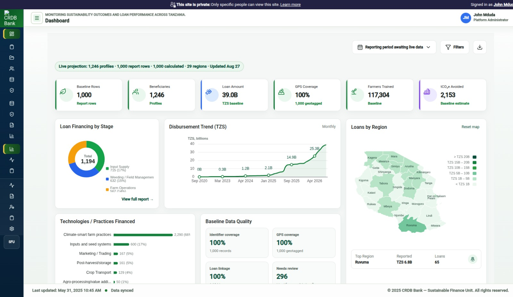
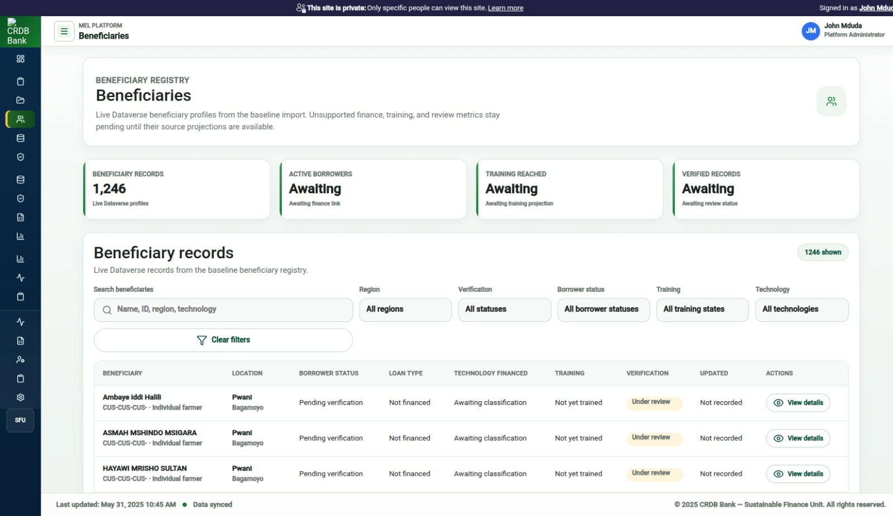
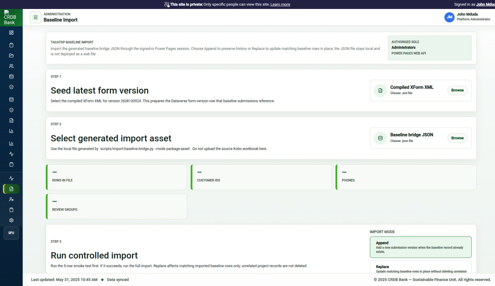
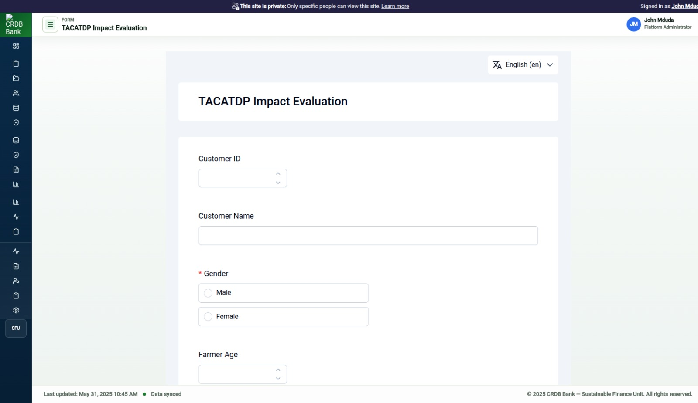
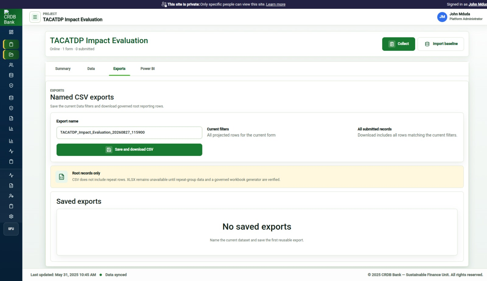

# Dashboard interface screenshot

Date: 2026-08-27

## Purpose

This document supports the required dashboard screenshot deliverable.

The dashboard screenshot shows the TACATDP monitoring dashboard after baseline data has loaded. The screenshot is prototype evidence and is not an official CRDB Bank or Green Climate Fund report.

## Captured screenshots

The screenshots show the current deployed prototype build, including dashboard, beneficiary registry, baseline import, form runtime, and reporting/export capability.

| File | Purpose |
|---|---|
| `assets/01-dashboard-overview.jpg` | Dashboard overview with baseline KPI projection, map, technology/practice chart, and baseline data-quality card. |
| `assets/02-beneficiaries-list.jpg` | Beneficiary registry/list view populated from imported baseline records. |
| `assets/03-baseline-import.jpg` | Baseline import route used by administrators to append or replace cleaned baseline data. |
| `assets/04-form-runner.jpg` | Field data collection form runtime. |
| `assets/05-reporting-export.jpg` | Reporting/export route for submitted baseline records. |

Primary visual evidence:

Additional prototype evidence:

## Required dashboard elements

The screenshot should show:

- CRDB/TACATDP application shell.
- Dashboard route.
- KPI summary row.
- Regional Tanzania map.
- Loan/financing or financed-stage card.
- Technologies/practices financed card.
- Training and climate outcome cards where data is available.
- Recent submissions or reporting-status card.
- Baseline data-quality summary replacing metrics that require unavailable CRDB operational feeds.

## Screenshot notes to include in submission

Use this caption:

> Dashboard interface showing prototype TACATDP baseline monitoring projections. Values shown are derived from imported baseline data where available. Metrics that require CRDB operational feeds are excluded from the dashboard until the approved source data is connected.

## Metrics interpretation

| Metric area | Interpretation |
|---|---|
| Beneficiaries | Imported baseline beneficiary profiles or report rows. |
| Reported amount | Reported loan amount from the baseline dataset. |
| Regional map | Baseline regional coverage and reported loan amount by region. |
| Technologies/practices | Baseline technology fields or financed value-chain stages where exact technology fields are unavailable. |
| Training | Baseline training fields where present. |
| Baseline data quality | Completeness and linkage checks derived from imported baseline records. |
| Disbursement trend | Requires dated loan records exposed to the dashboard projection. |

## Acceptance checklist

- [x] Screenshot is captured after the import completes.
- [x] Loading states have cleared where data exists.
- [x] Unsupported external-feed metrics are not presented as live results.
- [x] Browser zoom is normal.
- [x] The screenshot does not expose sensitive individual beneficiary details.
- [x] The screenshot caption states that the dashboard is a prototype baseline projection.
